# Flow ระบบ TGM BI Dashboard

เอกสารนี้อ้างอิงจากโค้ดใน `tgm-local/` เวอร์ชันปัจจุบัน ใช้สำหรับดูภาพรวมระบบ ตรวจ flow งาน และอธิบายให้ทีมเข้าใจตรงกัน

## 1. โครงสร้างหลัก

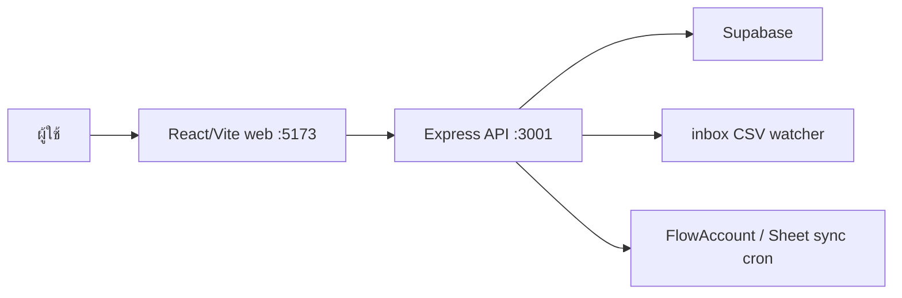

- `web/` คือหน้าใช้งาน
- `server/` คือ API กลางและงานอัตโนมัติ
- `Supabase` เก็บข้อมูลดิบ, master, user, และ summary ผ่าน RPC
- `inbox/` ใช้วาง CSV เพื่อให้ระบบนำเข้าอัตโนมัติ

## 2. Login และสิทธิ์

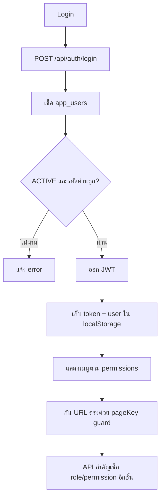

Role หลัก:

- `ADMIN` ใช้ได้ทุกหน้าและจัดการระบบได้
- `UPLOADER` ใช้งาน upload/กรอกข้อมูลบางส่วนได้
- `VIEWER` ดูข้อมูลตาม permission ที่กำหนด

## 3. Upload CSV จากหน้าเว็บ

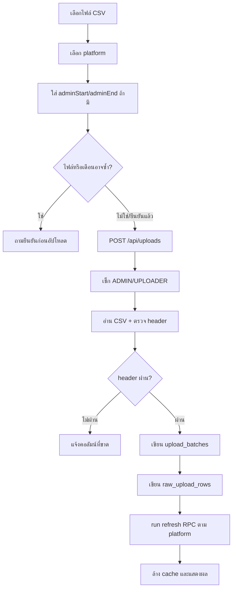

หมายเหตุ:

- Upload ซ้ำได้ แต่ระบบจะเตือนก่อนถ้าเจอชื่อไฟล์เดิมหรือเดือนเดิม
- Rollback ใช้ลบข้อมูลของ `batch_id` นั้นออกจาก `raw_upload_rows`
- Modern Trade ปลายทางคือ `ModernTrade`

## 4. Inbox อัตโนมัติ

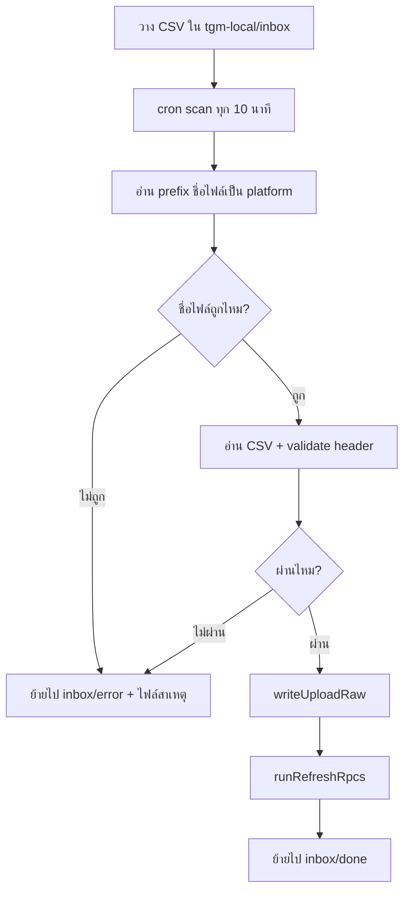

ตัวอย่างชื่อไฟล์:

- `TiktokOrder_2026-06-01_2026-06-30.csv`
- `ShopeeSettlement_2026-06.csv`
- `MetaAds_Jun2026.csv`

## 5. Google Sheet Sync

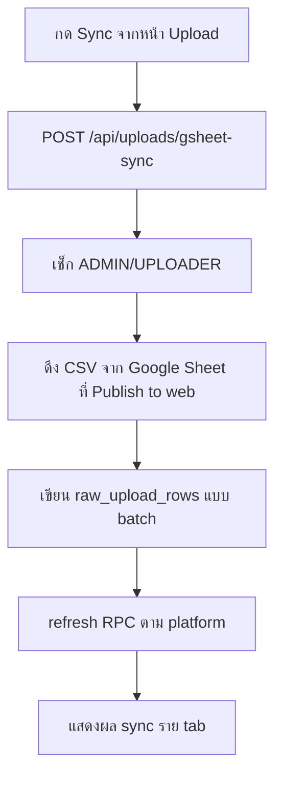

Flow นี้ใช้กับ Daily Report Sheet เช่น TikTok Analytics, Shopee Orders, Shopee Affiliate, TikTok Affiliate

## 6. Dashboard

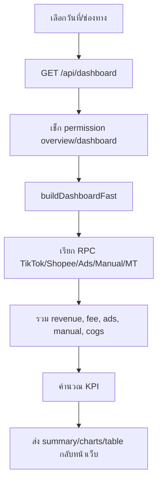

สูตรหลัก:

- `Profit = Revenue - Deductions - Ads`
- `Net Income = Profit - COGS`
- `ROAS = Revenue / Ads`
- `Net Margin = Net Income / Revenue`

## 7. Deep Audit และ Reconcile

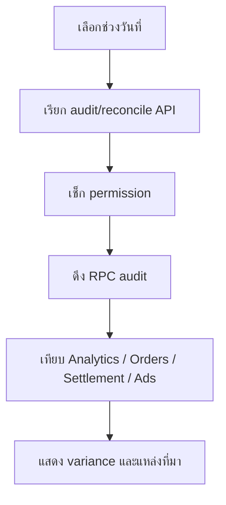

TikTok Analytics GMV กับ Order GMV ไม่จำเป็นต้องเท่ากัน เพราะนิยามยอด, refund, cancel และเวลานับต่างกัน

## 8. Upload Log และ Rollback

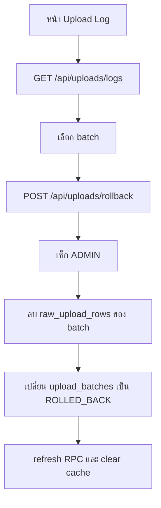

## 9. Manual Finance

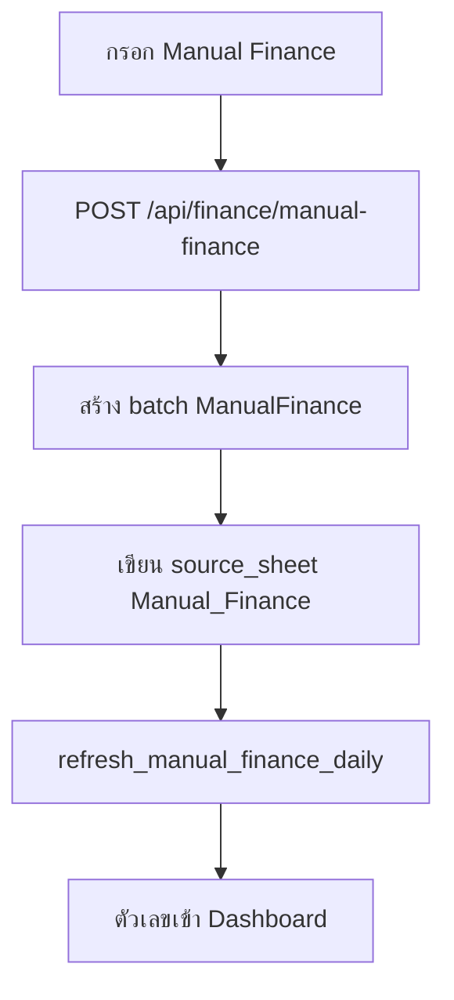

เงื่อนไข `Apply_To`:

- `ADS` เพิ่มเป็นค่าโฆษณา
- `COGS` เพิ่มเป็นต้นทุน
- ค่าอื่นนับเป็น deduction
- `INCOME` เพิ่มเข้า revenue

## 10. Modern Trade

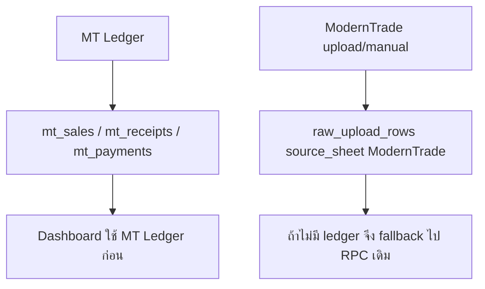

ข้อควรระวัง:

- Batch แบบ ModernTrade อาจนับซ้ำถ้า PO เดิมถูกนำเข้าซ้ำ
- MT Ledger เหมาะกับงานที่ต้องแก้รายเดือน เพราะใช้ upsert

## 11. Payables และ Bank Reconcile

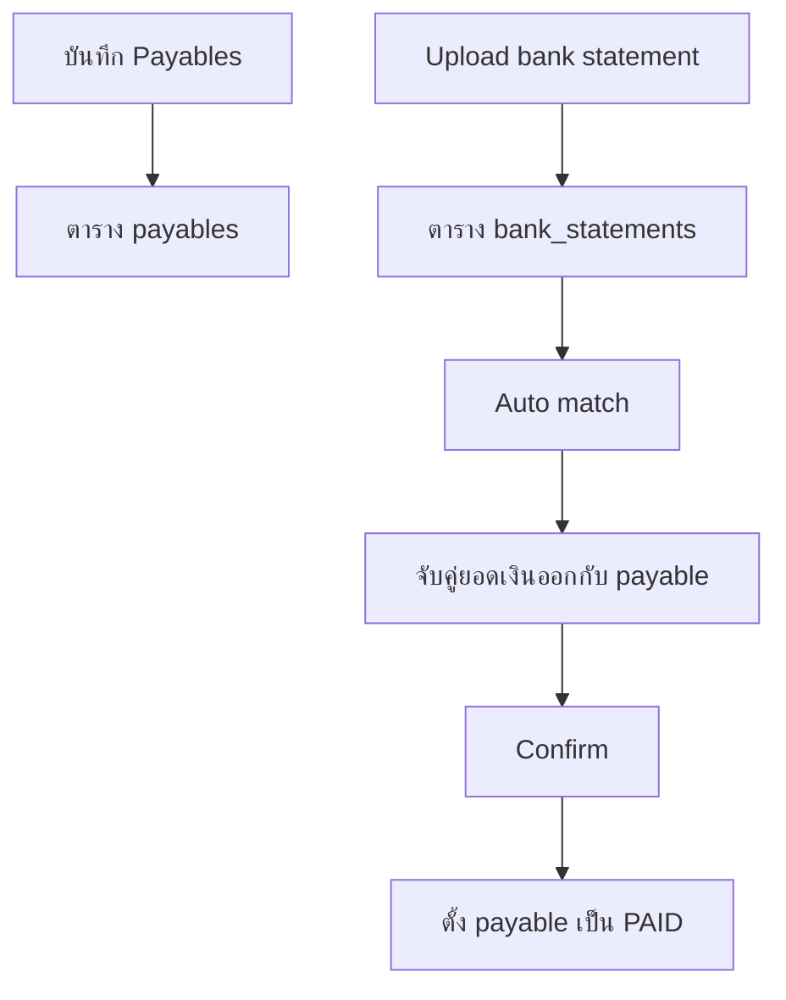

Auto match ใช้เงื่อนไขยอดใกล้กันไม่เกินประมาณ 0.5 บาท และวันที่ใกล้ due date ตามจำนวนวันที่กำหนด

## 12. Stock Update

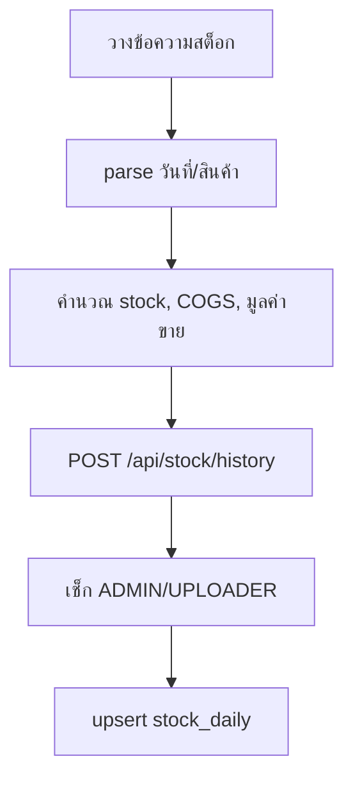

สิทธิ์:

- บันทึก/ลบรายวัน: `ADMIN`, `UPLOADER`
- ล้างทั้งหมด/เพิ่มราคาทุน: `ADMIN`

## 13. จุดตรวจเมื่อผิดปกติ

- Login ไม่ได้: เช็ก `app_users`, status, password, JWT
- Upload ไม่เข้า: เช็ก platform, header, upload log, `inbox/error`
- Dashboard ไม่เปลี่ยน: เช็ก batch, refresh RPC, cache, date range
- สิทธิ์ไม่ขึ้น: แก้ permissions แล้ว logout/login ใหม่
- ยอดไม่ตรง: เปิด Deep Audit และดู source แยก platform

