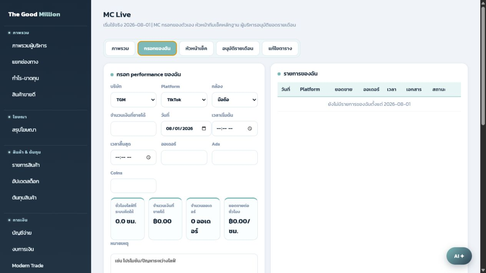

# คู่มือสำหรับ MC

ใช้หน้านี้สำหรับกรอกผลไลฟ์ของตัวเองทุกครั้งหลังจบไลฟ์

## ขั้นตอนกรอกข้อมูล

1. เข้าเมนู `MC Live`
2. กดแท็บ `กรอกของฉัน`
3. เลือก `บริษัท`
   - `TGM` เลือกได้ทั้ง TikTok และ Shopee
   - `Nola` ใช้ TikTok เท่านั้น ระบบจะล็อก Platform ให้เอง
4. เลือก `Platform`
5. เลือกประเภทกล้อง
   - `มือถือ` ต้องแนบ 3 รูป
   - `OBS` ต้องแนบ 1 รูป
6. กรอก `จำนวนเงินที่ขายได้`
7. เลือก `วันที่`
8. กรอก `เวลาเริ่มต้น` และ `เวลาสิ้นสุด`
9. กรอก `จำนวนออเดอร์`, `Ads`, `Coins` ถ้ามี
10. แนบรูปหลักฐานให้ครบ
11. กด `บันทึกของฉัน`

## เอกสารที่ต้องแนบ

กรณีใช้มือถือ:

- ภาพหน้าจอที่ไลฟ์
- หน้ายอดขาย
- หน้าจบไลฟ์

กรณีใช้ OBS:

- ภาพหน้าจอไลฟ์ 1 รูป ที่เห็นข้อมูลยืนยันว่าเป็นไลฟ์ของรอบนั้น

## ตัวเลขที่ระบบคิดให้

ระบบจะคำนวณให้อัตโนมัติจากเวลาที่กรอก:

- ชั่วโมงไลฟ์รวม
- จำนวนเงินที่ขายได้
- จำนวนออเดอร์
- ยอดขายต่อชั่วโมง

## การแก้ไข

- ถ้าหัวหน้ายังไม่เช็ค หรือยังไม่อนุมัติรายเดือน สามารถแก้รายการของตัวเองได้
- ถ้ารายการถูกส่งกลับแก้ไข ให้เปิดรายการเดิมแล้วแนบรูปหรือแก้ยอดให้ถูกต้อง
- ถ้าผู้บริหารอนุมัติเดือนแล้ว รายการจะถูกล็อก แก้ไม่ได้จนกว่าผู้บริหารเปิดเดือนกลับมาแก้ไข

