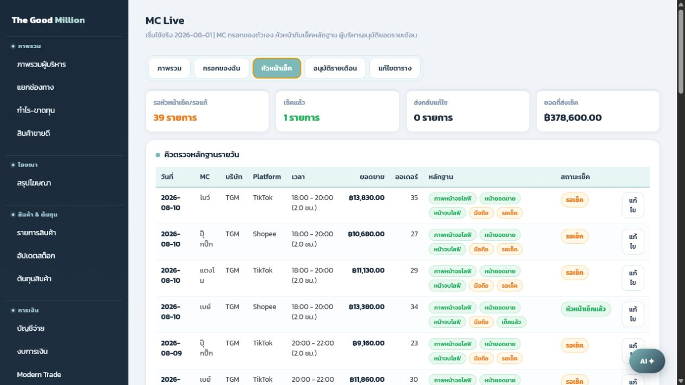

# คู่มือสำหรับหัวหน้า MC

หัวหน้า MC ใช้หน้านี้เพื่อตรวจหลักฐานของแต่ละรายการ ก่อนส่งต่อให้ผู้บริหารอนุมัติรายเดือน

## ขั้นตอนตรวจ

1. เข้าเมนู `MC Live`
2. กดแท็บ `หัวหน้าเช็ค`
3. ใช้ตัวกรองเพื่อดูเฉพาะรายการที่ต้องตรวจ เช่น MC, Platform, สถานะ หรือวันที่
4. กดรายการที่ต้องการตรวจ
5. เปิด Preview รูปหลักฐาน
6. ตรวจตาม checklist
7. ถ้าถูกต้อง กด `เช็คแล้ว ถูกต้องครบถ้วน`
8. ถ้าไม่ถูกต้อง พิมพ์เหตุผลแล้วกด `ส่งกลับไปแก้ไข`

## Checklist ก่อนกดเช็คแล้ว

- Platform ตรงกับที่ MC กรอก
- วันที่ตรงกับรอบไลฟ์
- เวลาเริ่มต้นและเวลาสิ้นสุดสมเหตุสมผล
- ยอดขายตรงกับภาพหน้ายอดขาย
- จำนวนออเดอร์ตรงกับภาพหรือข้อมูลสรุป
- มือถือแนบครบ 3 รูป
- OBS แนบรูปหน้าจอไลฟ์ครบ 1 รูป
- ถ้ารูปไม่ชัดหรือข้อมูลไม่ตรง ให้ส่งกลับแก้ไข

## สถานะที่ควรรู้

- `รอเช็ค`: MC ส่งรายการมาแล้ว แต่หัวหน้ายังไม่ได้ตรวจ
- `หัวหน้าเช็คแล้ว`: ตรวจแล้วและพร้อมให้ผู้บริหารอนุมัติ
- `ส่งกลับแก้ไข`: หัวหน้าพบปัญหา ต้องให้ MC แก้ก่อน
- `อนุมัติรายเดือนแล้ว`: ผู้บริหารล็อกยอดเดือนนั้นแล้ว

## การส่งกลับแก้ไข

ควรเขียนเหตุผลให้ชัด เช่น:

- ยอดขายไม่ตรงกับรูป
- แนบรูปไม่ครบ
- Platform ไม่ตรง
- เวลาไลฟ์ไม่ตรงกับหลักฐาน
- รูปอ่านไม่ชัด

