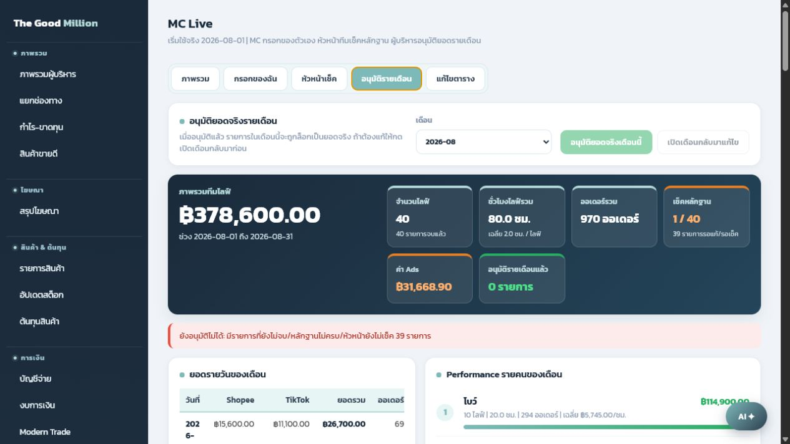
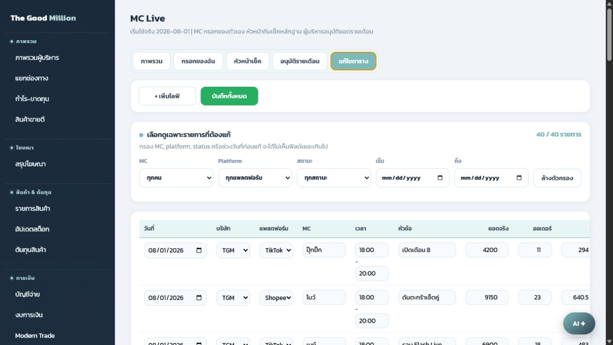

# คู่มือสำหรับผู้บริหาร

ผู้บริหารใช้หน้านี้เพื่อดูภาพรวม performance รายวัน รายคน และอนุมัติยอดจริงรายเดือน

## หน้าภาพรวม

หน้าภาพรวมใช้ดูตัวเลขหลัก:

- ภาพรวมทีมไลฟ์
- จำนวนไลฟ์
- ชั่วโมงไลฟ์รวม
- ออเดอร์รวม
- ค่า Ads
- จำนวนรายการที่เช็คหลักฐานแล้ว
- Performance รายคน
- สรุปยอดรายวัน

## การดูรายละเอียดรายคน

ในหน้าภาพรวมและหน้าอนุมัติรายเดือน สามารถดู performance รายคนได้ เช่น:

- ยอดขายรวมของแต่ละ MC
- จำนวนไลฟ์
- ชั่วโมงไลฟ์
- จำนวนออเดอร์
- ยอดขายเฉลี่ยต่อชั่วโมง
- รายการที่ยังต้องเช็คหรือส่งกลับแก้ไข

## การอนุมัติรายเดือน

1. เข้าเมนู `MC Live`
2. กดแท็บ `อนุมัติรายเดือน`
3. เลือกเดือนที่ต้องการตรวจ
4. ตรวจยอดรวม, รายวัน, รายคน และสถานะหลักฐาน
5. ถ้ารายการยังไม่ครบ ระบบจะไม่ให้อนุมัติ
6. ถ้าถูกต้องครบถ้วน กด `อนุมัติยอดจริงเดือนนี้`

## หลังอนุมัติ

- รายการของเดือนนั้นจะถูกล็อกเป็นยอดจริง
- MC และหัวหน้าจะไม่สามารถแก้ไขรายการที่อนุมัติแล้ว
- ถ้าต้องแก้ย้อนหลัง ผู้บริหารต้องกด `เปิดเดือนกลับมาแก้ไข` ก่อน

## หน้าตารางแก้ไข

ใช้เมื่อจำเป็นต้องแก้ไขหลายรายการพร้อมกัน เช่น แก้ยอด, เวลา, สถานะ หรือเอกสาร โดยควรใช้เฉพาะหัวหน้าหรือผู้บริหาร

