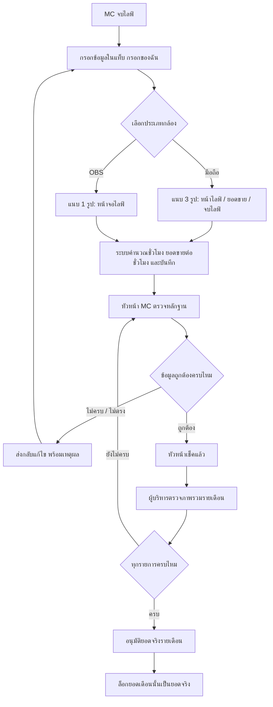

# Flow การทำงาน MC Live

## สิทธิ์โดยบทบาท

| บทบาท | ทำอะไรได้ |
|---|---|
| MC | กรอกและแก้ไขรายการของตัวเองก่อนอนุมัติ |
| หัวหน้า MC | ตรวจหลักฐาน, ส่งกลับแก้ไข, แก้ไขรายการทีม |
| ผู้บริหาร | ดูภาพรวม, ตรวจรายคน, อนุมัติยอดจริงรายเดือน, เปิดเดือนกลับมาแก้ไข |

## เกณฑ์อนุมัติรายเดือน

ก่อนอนุมัติ ต้องผ่านครบทุกข้อ:

- รายการจบไลฟ์แล้ว
- เอกสารครบตามประเภทกล้อง
- หัวหน้า MC เช็คแล้ว
- ไม่มีรายการที่ถูกส่งกลับแก้ไขค้างอยู่

