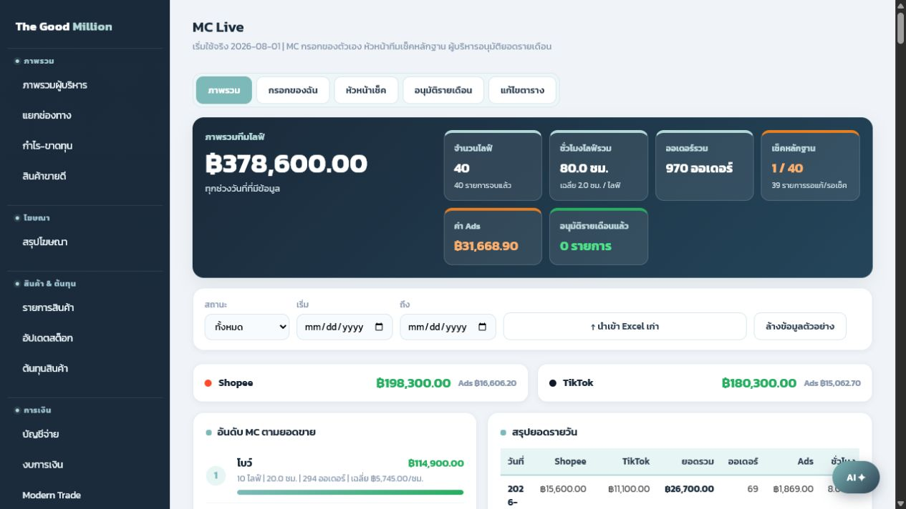

# คู่มือ MC Live

เอกสารชุดนี้แยกตามบทบาทการใช้งาน เพื่อให้ทีม MC, หัวหน้าทีม และผู้บริหารใช้ระบบได้ตรงกัน

- [คู่มือสำหรับ MC](01-คู่มือ-MC.md)
- [คู่มือสำหรับหัวหน้า MC](02-คู่มือหัวหน้า-MC.md)
- [คู่มือสำหรับผู้บริหาร](03-คู่มือผู้บริหาร.md)
- [Flow การทำงานทั้งระบบ](04-flow-mc-live.md)

## ภาพรวมหน้าจอ

## หลักการสำคัญ

- เริ่มใช้งานจริงตั้งแต่วันที่ 2026-08-01
- MC กรอกได้เฉพาะรายการของตัวเอง
- หัวหน้า MC ตรวจหลักฐานและส่งกลับแก้ไขได้
- ผู้บริหารอนุมัติรายเดือนเป็นขั้นตอนสุดท้าย
- เมื่อผู้บริหารอนุมัติแล้ว ยอดเดือนนั้นถือเป็นยอดจริงและรายการจะถูกล็อก

